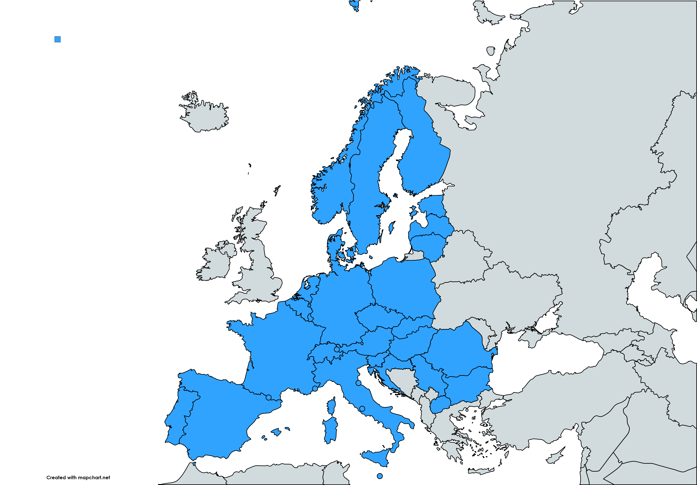
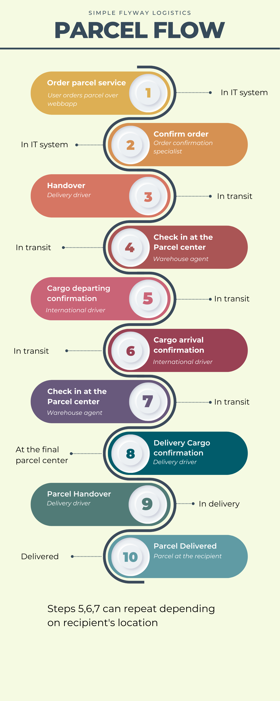
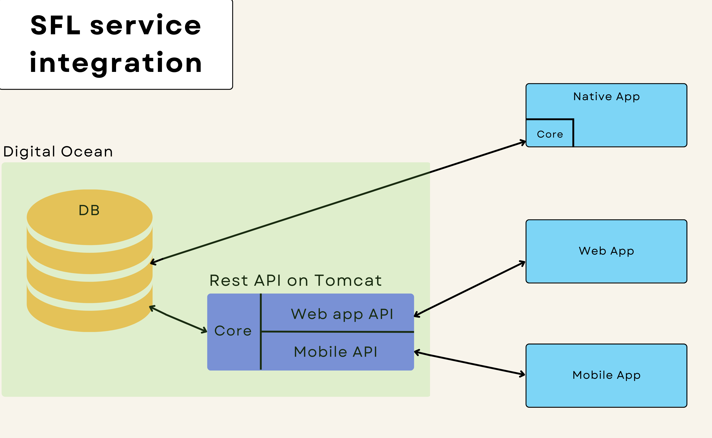
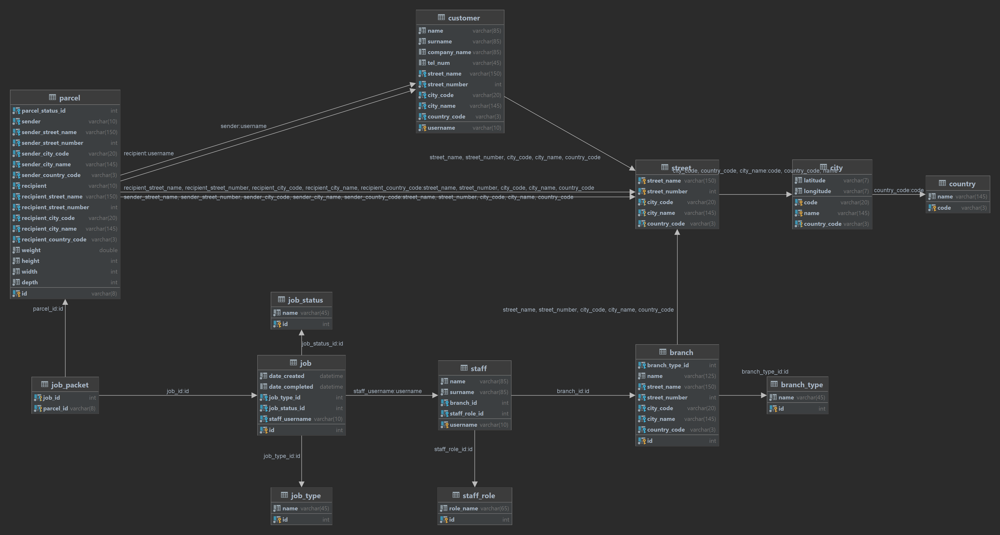

# SFL (Simple Flyway Logistics)
Informacijski sistem za logistično podporo kurirski službi

## Kazalo
- [Uvod](#uvod)
- [Opis delovanja sistema](#opis-delovanja-sistema)
- [Podatkovna baza](#podatkovna-baza)
- [Spletna aplikacija](#spletna-aplikacija)
- [Zaledna aplikacija](#zaledna-aplikacija)
- [Mobilna aplikacija](#mobilna-aplikacija)
- [Možnje nadgradnje](#možne-nadgradnje)

## Uvod:
Z informacijskim sistemom smo podprli delo v kurirski službi. Sistem omogoča check in paketov v skladišča, pregled nad paketi v skladišču, potrjevanje tovora med premikanjem iz skladišč in pred dostavo, potrjevanje dostave paketa za podjetje in sledenje paketa, ter spremembo naslova dostave za stranke podjetja. Uporabniki sistema so zaposleni in stranke podjetja.

Sistem podpira dostavo v 33 držav.

Opravila opravljajo uporabniki glede na njihove vloge:
- Warehouse manager
- Warehouse agent
- Delivery driver
- International driver
- Logistics agent
- Order confirmation specialist

Vsak paket mora preiti čez več opravil, ki so razdeljene v tipe:
- Order processing
- Handover
- Check in
- Cargo departing confirmation
- Cargo arrival confirmation
- Delivery cargo confirmation
- Parcel handover

Med potovanjem se samemu paketu prav tako spreminjajo statusi:
- In IT system
- In transit
- At the final parcel center
- In delivery
- Delivered

## Opis delovanja sistema:
Informacijski sistem je sestavljen iz MySQL podatkovne baze, zaledne aplikacije, spletne aplikacije, dveh REST API-jev in mobilne aplikacije (Android) povezuje pa jih jedrni modul SFL-Core. Podatkovna baza, REST API-ja in spletna aplikacija so gostovane pri ponudniku Digital Ocean.

## Podatkovna baza:

## Spletna aplikacija
Stranka se lahko prijavi v aplikacijo z njegovim uporabniškim imenom in geslom ali pa brez prijave izvede sledenje paketa (če ima njegovo šifro).
Ob uspešni prijavi lahko stranka gleda njene poslane in prejete pakete, ter ustvari novo naročilo.

## Zaledna aplikacija
V zaledno aplikacijo se lahko prijavljajo vsi zaposleni, kjer se jim prikažejo pogledi glede na njihovo uporabniško vlogo.

## Mobilna aplikacija
Zaposleni se prijavi v aplikacijo z njegovim uporabniškim imenom in geslom.
Zaposlenemu se glede na njegovo vlogo v podjetju (uporabniška hierarhija) odprejo različna opravila:
- Skladiščniki in vozniki vidijo svoja opravila, ki jih morajo opraviti (to naredijo z skeniranjem QR kode paketa).
- Vodja skladišča lahko vidi pregled nad celotnim skladiščem (kjer je zaposlen).

Zaslonske slike so dostopne na [povezavi](https://github.com/cugalord/SFL-TPO/tree/main/docs/mobile).

## Možne nadgradnje
Možne nadgradnje za $$$:
- optimizacija routing algoritma
- lepši izgled mobilne aplikacije za zaposlene
- lepši izgled spletne aplikacije
- spletna aplikacija za zaposlene
- mobilna aplikacija za stranke
- OLAP storitve ZA logistike (grafana, olap kocka...)

